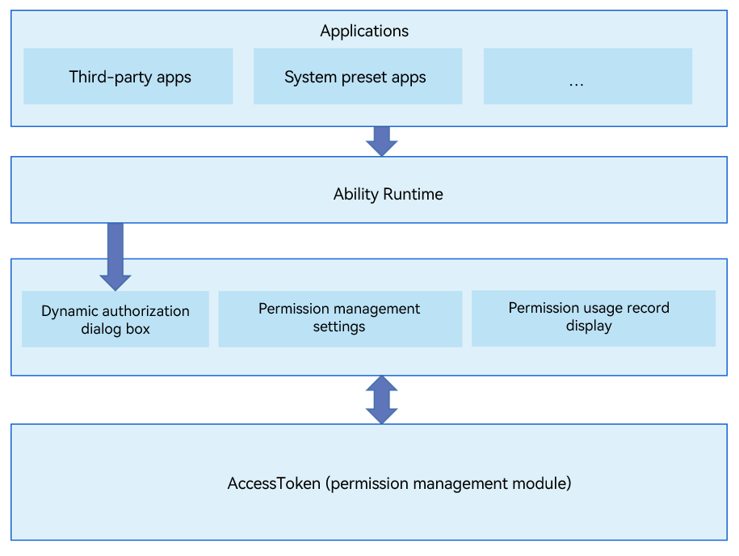

# PermissionManager


## Introduction

PermissionManager, a system application preset in OpenHarmony, provides permission dialog boxes, permission management settings, and permission usage records during the running of apps.

The following figure shows the architecture of the PermissionManager application.

## Directory Structure

```
/applications/standard/permission_manager
├── entry                              # Directory of the entry module
├── permissionmanager                  # Directory of the PermissionManager module
│   ├── src/main/ets                   # ets module
│   │       ├── Application            # abilitystage directory
│   │       ├── MainAbility            # Permission management ability
│   │       ├── ServiceExtAbility      # serviceExtension configuration
│   │       ├── common                 # Common utilities
│   │       └── pages                  # Pages
│   ├──  resources                     # Global resource files
│   └──  module.json5                  # Global configuration file
├── signature                          # Certificate files
└── LICENSE                            # License file
```

## Installation, operation and commissioning<a name="section1548654218"></a>

### Application installation

- There are two files that need to change the suffix to json5

```
/AppScope/app.json
/permissionmanager/src/main/module.json
```

- Uninstall preset rights management for the first installation

```html
hdc shell mount -o remount,rw /
hdc shell rm -rf /system/app/com.ohos.permissionmanager
hdc shell rm -rf /data/*
hdc shell reboot
```

- Install the signed hap package

```html
hdc install Packet path
```

### Application running

- Permission dialog：[requestPermissionsFromUser](https://gitee.com/openharmony/docs/blob/master/zh-cn/application-dev/reference/apis/js-apis-abilityAccessCtrl.md#requestpermissionsfromuser9)
```JS
import abilityAccessCtrl from '@ohos.abilityAccessCtrl';
let atManager = abilityAccessCtrl.createAtManager();
try {
    atManager.requestPermissionsFromUser(this.context, ['ohos.permission.CAMERA'], (err, data)=>{
        console.info('data:' + JSON.stringify(data));
        console.info('data permissions:' + data.permissions);
        console.info('data authResults:' + data.authResults);
    });
} catch(err) {
    console.log(`catch err->${JSON.stringify(err)}`);
}
```

- Permission manager

Settings-Privacy-Permission Manager

### Application debugging

- Add log to the program

```JS
const TAG = "PermissionManager_Log"
console.info(TAG + `log`);
```
- Grab log：

```
hdc shell hilog -Q pidoff
hdc shell -b D
hdc shell hilog -r && hdc hilog > log.txt
```

### How to Use

For details, see [Permission Application Guide](https://gitee.com/openharmony/docs/blob/master/en/application-dev/security/accesstoken-guidelines.md).

## Repositories Involved

**[security\_access\_token](https://gitee.com/openharmony/security_access_token)**
