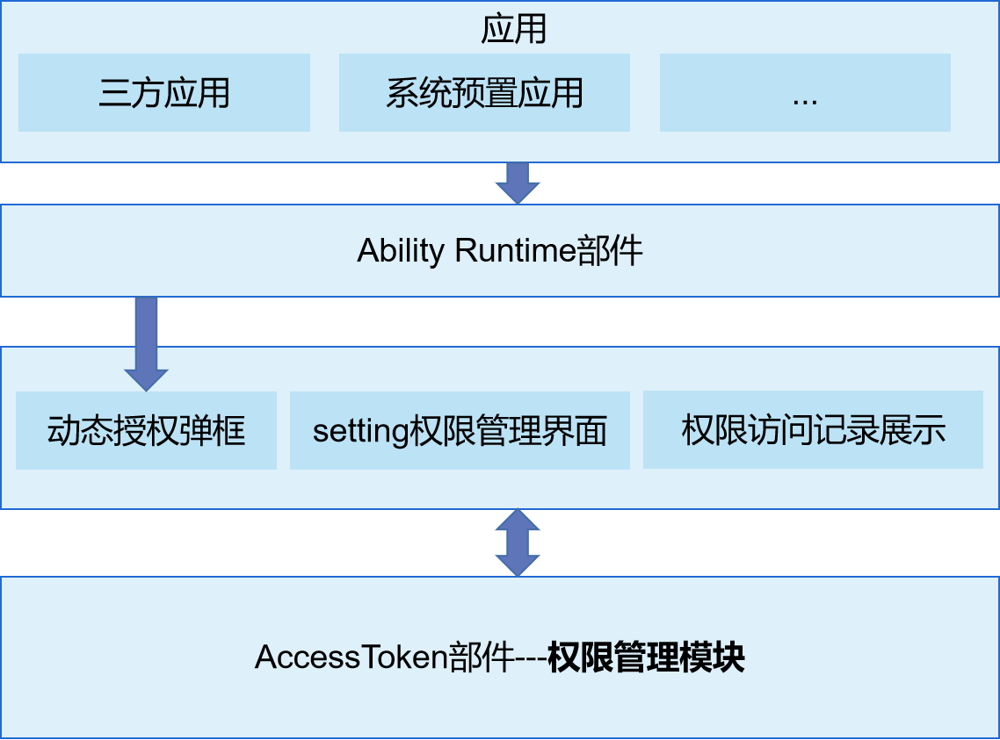

# 访问控制<a name="ZH-CN_TOPIC_0000001101239136"></a>


## 简介<a name="section11660541593"></a>

权限管理应用是OpenHarmony中预置的系统系统应用，为用户提供运行时权限弹框、权限管理设置和权限使用记录展示等功能。

权限管理应用的架构图如下所示：

## 目录<a name="section161941989596"></a>

```
/applications/standard/permission_manager
├── entry                              # entry模块目录
├── permissionmanager                  # 权限管理模块目录
│   ├── src/main/ets                   # ets模块
│   │       ├── Application            # abilitystage目录
│   │       ├── MainAbility            # 权限管理ability
│   │       ├── ServiceExtAbility      # serviceExtension配置目录
│   │       ├── common                 # 公共工具目录
│   │       └── pages                  # 页面目录
│   ├──  resources                     # 全局资源文件目录
│   └──  module.json5                  # 全局配置文件
├── signature                          # 证书文件目录
└── LICENSE                            # 许可文件
```

## 安装、运行、调试<a name="section1548654218"></a>

### 应用安装

- 代码编译有两个文件需要将后缀名修改为json5

```
/AppScope/app.json
/permissionmanager/src/main/module.json
```

- 初次安装需要卸载系统预置的权限管理

```html
hdc shell mount -o remount,rw /
hdc shell rm -rf /system/app/com.ohos.permissionmanager
hdc shell rm -rf /data/*
hdc shell reboot
```

- 安装签过名的hap包

```html
hdc install 包路径
```

### 应用运行

- 权限弹窗：[requestPermissionsFromUser](https://gitee.com/openharmony/docs/blob/master/zh-cn/application-dev/reference/apis/js-apis-abilityAccessCtrl.md#requestpermissionsfromuser9)
```JS
import abilityAccessCtrl from '@ohos.abilityAccessCtrl';
let atManager = abilityAccessCtrl.createAtManager();
try {
    atManager.requestPermissionsFromUser(this.context, ['ohos.permission.CAMERA'], (err, data)=>{
        console.info('data:' + JSON.stringify(data));
        console.info('data permissions:' + data.permissions);
        console.info('data authResults:' + data.authResults);
    });
} catch(err) {
    console.log(`catch err->${JSON.stringify(err)}`);
}
```

- 权限管理

设置-隐私-权限管理

### 应用调试

- 在程序中添加 log

```JS
const TAG = "PermissionManager_Log"
console.info(TAG + `log`);
```
- 抓取log日志：

```
hdc shell hilog -Q pidoff
hdc shell -b D
hdc shell hilog -r && hdc hilog > log.txt
```

## 使用说明<a name="section123459000"></a>

参见使用说明 [使用说明](https://gitee.com/openharmony/docs/blob/master/zh-cn/application-dev/security/accesstoken-guidelines.md)

## 相关仓<a name="section1371113476307"></a>

**[security\_access\_token](https://gitee.com/openharmony/security_access_token/blob/master/README_zh.md)**
