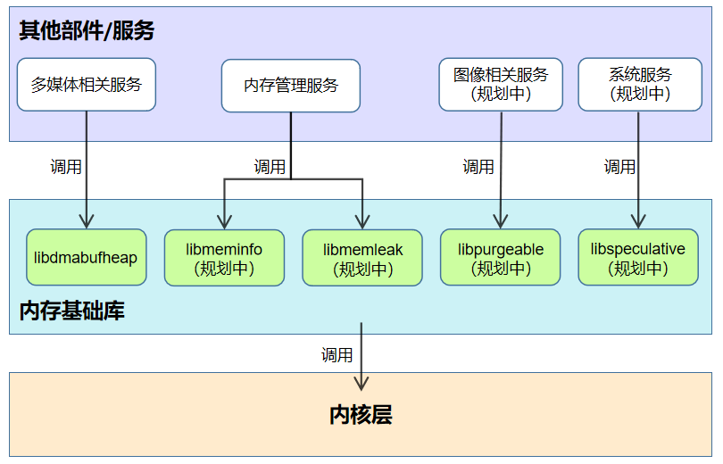

# 内存基础库部件

- [内存基础库部件](#内存基础库部件)
  - [简介<a name="section_introduction"></a>](#简介)
  - [部件架构<a name="section_architecture"></a>](#部件架构)
  - [目录<a name="section_catalogue"></a>](#目录)
  - [内存基础库<a name="section_libraries"></a>](#内存基础库)
    - [libdmabufheap系统库<a name="section_libdmabufheap"></a>](#libdmabufheap系统库)
    - [libmeminfo系统库（规划中）<a name="section_libmeminfo"></a>](#libmeminfo系统库规划中)
    - [libmemleak系统库（规划中）<a name="section_libmemleak"></a>](#libmemleak系统库规划中)
    - [libpurgeable系统库<a name="section_libpurgeable"></a>](#libpurgeable系统库)
    - [libspeculative系统库（规划中）<a name="section_libspeculative"></a>](#libspeculative系统库规划中)
  - [使用说明<a name="section_usage"></a>](#使用说明)
  - [相关仓<a name="section_projects"></a>](#相关仓)

## 简介<a name="section_introduction"></a>

内存基础库部件位于公共基础库子系统中，为上层业务提供对应的操作内存的系统库，保证上层业务的稳定性。

## 部件架构<a name="section_architecture"></a>

**图1** 内存基础库部件架构图



| 内存基础库 | 使用者                  |
| -------------- | -------------------------- |
| libdmabufheap  | 多媒体相关服务      |
| libmeminfo     | 内存管理服务         |
| libmemleak     | 内存管理服务         |
| libpurgeable   | 图形图像相关服务   |
| libspeculative | 系统服务（规划中） |

## 目录<a name="section_catalogue"></a>

```
/utils/memory
├── libdmabufheap           # DMA (Direct Memory Access) 内存分配链接库
│   ├── include             # DMA内存分配链接库头文件目录
│   ├── src                 # DMA内存分配链接库源代码目录
│   └── test                # DMA内存分配链接库自测用例目录
├── libmeminfo              # 内存占用查询库
├── libmemleak              # 内存泄漏检测库
├── libpurgeable            # 可丢弃类型内存管理库
│   ├── include             # purgeable类型内存分配链接库头文件目录
|   │   ├── c               # purgeable类型内存分配的c接口目录
|   │   ├── common          # purgeable类型内存分配的公共接口目录
|   │   └── cpp             # purgeable类型内存分配的cpp接口目录
│   ├── src                 # purgeable类型内存分配链接库源代码目录
│   └── test                # purgeable类型内存分配链接库自测用例目录
└── libspeculative          # 投机类型内存管理库
```

## 内存基础库<a name="section_libraries"></a>

内存基础库是集成内存操作的系统库的部件，对内存操作的系统库进行统一管理。

### libdmabufheap系统库<a name="section_libdmabufheap"></a>

为多媒体相关服务提供分配共享内存的接口，通过在硬件设备和用户空间之间分配和共享内存，实现
设备、进程间零拷贝内存，提升执行效率。

### libmeminfo系统库（规划中）<a name="section_libmeminfo"></a>

提供内存占用查询接口，用于内存占用信息查询、低内存查杀等场景。

### libmemleak系统库（规划中）<a name="section_libmemleak"></a>

配合malloc_debug做native heap内存泄漏检测。

### libpurgeable系统库<a name="section_libpurgeable"></a>

为多媒体相关服务提供可丢弃类型内存的专用内存申请接口。在系统可用内存不足时，purgeable内存被系统直接丢弃，实现内存快速回收。应用再次被使用时，已经被释放的purgeable内存能够进行重建。

### libspeculative系统库（规划中）<a name="section_libspeculative"></a>

提供投机类型内存管理接口，用于缓存预读。

## 使用说明<a name="section_usage"></a>

系统开发者可以通过配置productdefine/common/products下的产品定义json文件，增加或移除本部件，来启用或停用本部件。

` "commonlibrary:memory_utils":{} `

## 相关仓<a name="section_projects"></a>

[公共基础库子系统](https://gitee.com/openharmony/utils)